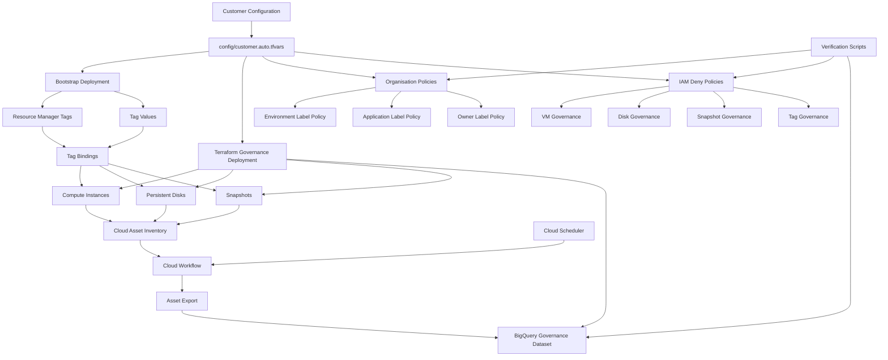

# GCP Governance Accelerator - Architecture

## Governance Layers

### Layer 1 - Preventive Controls

* Organisation Policies
* Custom Constraints
* Mandatory Labels

### Layer 2 - Enforcement Controls

* IAM Deny Policies
* Resource Manager Tags
* Tag Bindings

### Layer 3 - Detective Controls

* Cloud Asset Inventory
* BigQuery Governance Dataset
* Automated Asset Export

## Deployment Flow

1. Update customer.auto.tfvars
2. Generate environment configuration
3. Deploy bootstrap resources
4. Deploy Terraform governance resources
5. Enable governance controls
6. Verify controls
7. Monitor compliance through Asset Inventory exports

## Key Components

### Resource Manager Tags

Provides governance metadata across resources.

### Organisation Policies

Prevents creation of resources without required labels.

### IAM Deny Policies

Prevents modification or removal of governance controls.

### Cloud Asset Inventory

Exports resource inventory for compliance reporting.

### BigQuery

Stores governance inventory for reporting and analytics.
